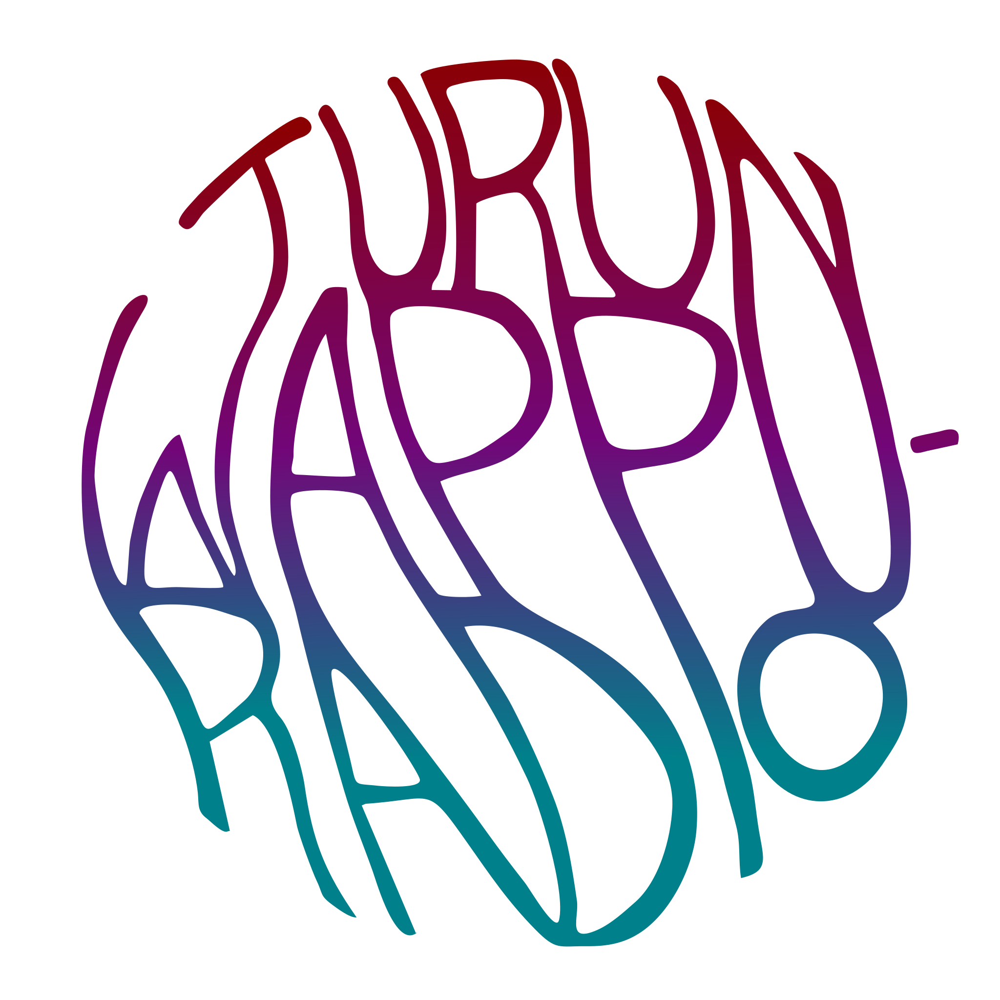

# Turun Wappuradio website

Something of a mutant project that builds a mostly static site with a couple of dynamic react-components to provide extra functionality.

## Project stack

- React for dynamic components
- Handlebars for static html-templates
- SASS to provide improved css-styling.
- Metalsmith for building static content
- Webpack for javascript build step and dev-engine.

## Running:

You need nodejs to get the build running smoothly. After the project has been build, dist can be served via any http-server. The start-script of this repo also starts a http-server that serves the files from dist.

1. `$ npm install` Installs dependencies
2. `$ npm run dev` Starts webpack-dev-server

## Code style

- Prefer css-classes even in dynamic content
- Format code using prettify
- Keep React components separated from static content

## License

MIT 2019 Julius Rajala, Turun Wappuradio
